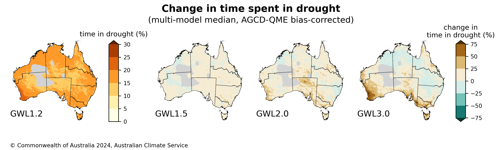

# ACS Hazard Team on Drought and Changes in Aridity

GitHub repository for ACS Drought and Changes in Aridity hazard team to store, track and develop code, key outputs and relevant analysis. 

Navigation: [Indices](https://github.com/AusClimateService/hazards-drought/tree/dev_readme?tab=readme-ov-file#indices) | [Product status](https://github.com/AusClimateService/hazards-drought/tree/dev_readme?tab=readme-ov-file#product-status) | [Key Figures](https://github.com/AusClimateService/hazards-drought/tree/dev_readme?tab=readme-ov-file#key-figures) | [Analysis for CRO](https://github.com/AusClimateService/hazards-drought/tree/dev_readme?tab=readme-ov-file#analysis-for-climate-risk-overview) | [Workflow](https://github.com/AusClimateService/hazards-drought/tree/dev_readme?tab=readme-ov-file#workflow) | [FAQs](https://github.com/AusClimateService/hazards-drought/tree/dev_readme?tab=readme-ov-file#FAQs) | [References](https://github.com/AusClimateService/hazards-drought/tree/dev_readme?tab=readme-ov-file#references) | [Team contacts](https://github.com/AusClimateService/hazards-drought/tree/dev_readme?tab=readme-ov-file#drought-hazard-team-contacts)  
Last updated: 10 July 2024
## Indices:
### Standardised Precipitation Index (SPI)
The Standardized Precipitation Index (SPI) is a widely used index that measures the amount of precipitation over a specific period relative to the long-term average for that period. It standardizes precipitation as a z-score, making it possible to compare different locations and time scales. The SPI is typically used to identify and quantify the severity of droughts. Positive SPI values indicate wetter-than-average conditions, while negative values indicate drier-than-average conditions. We use a SPI-3, aggregated over three months and a value of -1 or lower as a drought metric, signifying moderate drought conditions. It is valuable in water resource management, agriculture, and climate studies for its simplicity and effectiveness in drought monitoring (McKee et al, 1993).

### Aridity Index (AI)
The Aridity Index (AI) is a numerical indicator used to quantify the dryness of a region. It is calculated as the ratio of annual precipitation to potential evapotranspiration. Lower values of AI indicate more arid conditions, while higher values suggest more humid conditions. The AI is commonly used in climatology, agriculture, and environmental studies to classify climates, assess water availability, and manage land and water resources (UNEP, 1992).
Aridity categories based on AI values are as follows:
- Hyper-Arid: AI < 0.05
- Arid: 0.05 ≤ AI < 0.2
- Semi-Arid: 0.2 ≤ AI < 0.5
- Dry Sub-Humid: 0.5 ≤ AI < 0.65
- Humid: AI ≥ 0.65

### Rainfall percentiles
Rainfall percentiles are statistical measures used to evaluate and interpret precipitation data. They indicate the relative ranking of a given rainfall amount within a historical reference period. The 15th percentile we use on three-month rainfall aggregation (smiliar to SPI) represents a value below which 15% of the observed rainfall amounts fall, meaning it is drier than 85% of the reference data (WMO, 2017). The 15th percentile approximates an SPI value of -1, but instead if an inde value it provides the expected rainfall amount. This means that if the precipitation for a given time frame (e.g., GWL) is lower than the amount that is exceeded 85% of the time in the historical record, it is considered indicative of drought. This index helps in understanding and quantifying the severity and frequency of drought events by focusing on the lower tail of the precipitation distribution.

**For future deliveries:**
- Standardised soil mositure index (SSMI)
- Standardised Precipitation and Evapotranspiration Index (SPEI)
- Standardised runoff index (SRI)
- Evaporative Demand Drought Index (EDDI)
- Evaporative Stress Index (ESI)

## Product Status:
Status of the NCRA deliverables. 

The three dots (in order from first/top/left to last/bottom/right) represent the datasets used to compute indices:
- Dot 1: Pre-processed BARPA/CCAM – downscaled but NOT bias-corrected, 5 km (deliverable for 30 June)
- Dot 2: Bias-corrected BARPA/CCAM – downscaled AND bias-corrected, 5 km (deliverable for 31 July)
- Dot 3: National Hydrological Projections (NHP1.0) based on CMIP5 – bias-corrected, 5km
Where only one dot is in the cell the format type does not apply to the metric, e.g. no time series for rainfall 15th percentile.
 
In terms of the colors:
- :green_circle: The data is available in its final official form
- :yellow_circle: The data creation is currently in progress and available soon
- :red_circle: The data processing has not yet started
- :white_circle: Not intended for delivery/not applicable

| Index/metric | time series (ts) | GWLs ts | GWLs 2D | MME 2D | MME 2D change | Scheduled delivery date | Data location | Last update
|-----         | :-:              |:-:      |:-:      |:-:     |:-:            |------------    |-----             |-----
| SPI3 |:green_circle: :green_circle: :white_circle:|:green_circle: :green_circle: :white_circle:|:green_circle: :green_circle: :white_circle:|:green_circle: :green_circle: :white_circle:|:green_circle: :green_circle: :white_circle:|<ul><li>30 June</li><li>31 July</li><li>N/A</li></ul>|/g/data/ia39/ncra/ drought_aridity/spi/|29/06/24
| Rainfall 15th prctl |:white_circle:|:white_circle:|:green_circle: :green_circle: :white_circle:|:green_circle: :green_circle: :white_circle:|:green_circle: :green_circle: :white_circle:|<ul><li>30 June</li><li>31 July</li><li>N/A</li></ul>|/g/data/ia39/ncra/ drought_aridity/ rainfall_percentiles/|27/06/24
| AI |:white_circle: :white_circle: :green_circle:|:white_circle: :white_circle: :green_circle:|:white_circle: :white_circle: :green_circle:|:white_circle: :white_circle: :green_circle:|:white_circle: :white_circle: :green_circle:|<ul><li>N/A</li><li>N/A</li><li>31 July</li></ul>|/g/data/ia39/ncra/ drought_aridity/ai/|28/06/24

## Key Figures:
Figures for each 2D metric (SPI <= -1, AI, rainfall percentiles) and GWL as well as for changes relative to GWL 1.2 are located in the index directories (see data location in table above) in the sub directory `/figures/`. We have collated the SPI GWL change figures into an example plot visualised below. This figure depicts the change in 'time spent in drought (SPI <= -1)' for GWL 1.5, 2.0 and 3.0 relative to GWL 1.2 for the 10th, 50th and 90th percentile of the multi-model ensemble:

## Analysis for Climate Risk Overview:
Some relevant findings for time spent in drought (SPI <= -1) and changes in aridity for Australia and different NCRA regions are listed below. 
These findings are derived from datasets compiled using bias-corrected data. These statements are qualitative in nature. Our team also provides quantiative analysis with some caveats.
| NCRA region                  | Change in time spent in drought | Change in aridity |
|:--                           | :--                             |:--                |
|Australia                     | Considerable model spread, with only a few regions showing a consistent change signal. Median of multi-model spread indicates a general increase in time spent in drought. |   |
|Western Australia North       | Considerable model spread, no consistent change signal. |   |
|Western Australia South       | Consistent increase in time spent in drought for south-western WA, with the magnitude of change increasing with GWL. |   |
|New South Wales and ACT       | Considerable model spread, no consistent change signal. However, median and 10th percentile of multi-model spread indicate a general decrease in time spent in drought for the eastern seaboard.  |   |
|Victoria                      | Consistent increase in time spent in drought for south-western Victoria, with the magnitude of change increasing with GWL. |   |
|South Australia               | Consistent increase in time spent in drought for southern most regions of SA, with the magnitude of change increasing with GWL.|   |
|Tasmania                      | Considerable model spread, no consistent change signal. |   |
|Northern Territory            | Considerable model spread, no consistent change signal. |   |
|Queensland North              | Considerable model spread, no consistent change signal. |   |
|Queensland South              | Considerable model spread, no consistent change signal. |   |
|Australian Antarctic Territory|N/A          |N/A|
|Marine                        |N/A          |N/A|

**Quantitative summary:** Please note significant caveats apply in averaging 10th, 50th and 90th percentile multi-model ensembles to a spatial region as the representative model for the change is different at each gridcell. Thus we have distilled our quantitative change analysis on a model by model basis for each region, regions where more than 70% of all our ensemble members agree on the sign of the projected change are indicated in bold. This analysis could also be useful in devising regional storylines depending on selection of driest/wettest model. For the representative climate future associated with each GCM in the ACS analysis bucket refer to Table 3 from [Grose et al., 2023](https://doi.org/10.1016/j.cliser.2023.100368). 

## FAQs

## Workflow
The data for the outputs specified in the columns was produced using this workflow:

## References
* Mckee, T.B., Doesken, N.J., Kleist, J. (1993). The relationship of drought frequency and duration to time scales. In: Proceedings of the 8th Conference on Applied Climatology. American Meteorological Society, Boston, MA, pp. 179–183.
* United Nations Environment Programme (UNEP) (1992). World Atlas of Desertification. Edward Arnold. https://wedocs.unep.org/20.500.11822/42137
* WMO. (2017). WMO Guidelines on the Calculation of Climate Normals. WMO-No. 1203, 1203, 29. https://library.wmo.int/doc_num.php?explnum_id=4166

## Drought hazard team contacts
- [ ] David Hoffmann (BOM, lead)
- [ ] Tess Parker (CSIRO, alternate lead)
- [ ] Jessica Bhardwaj (BOM, contributor)
