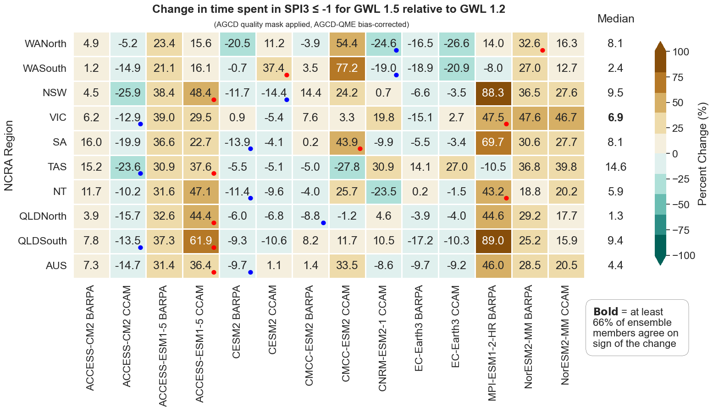
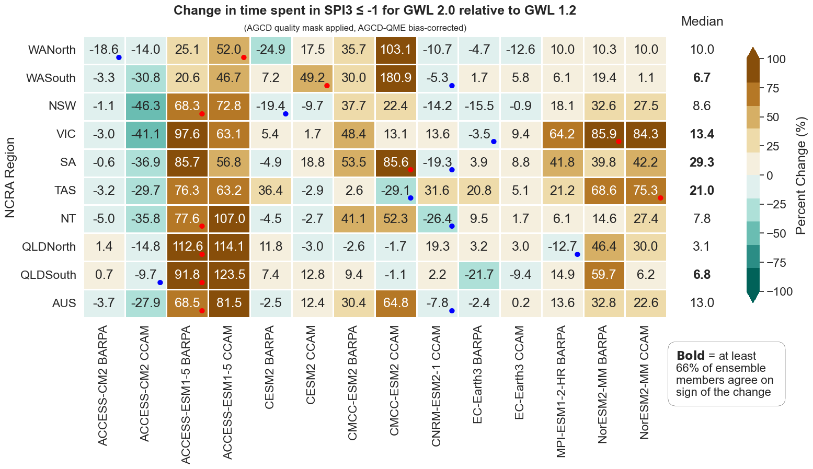
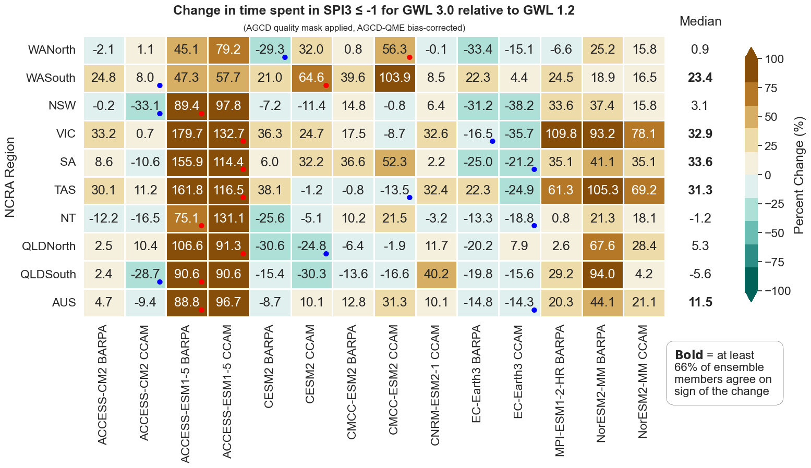

# ACS Hazard Team on Drought and Changes in Aridity

GitHub repository for ACS Drought and Changes in Aridity hazard team to store, track and develop code, key outputs and relevant analysis. 

**Navigation:** [Info](https://github.com/AusClimateService/hazards-drought#information-about-our-indices) | [Product status](https://github.com/AusClimateService/hazards-drought/tree/main#product-status) | [Figures](https://github.com/AusClimateService/hazards-drought/tree/main#figures) | [Analysis for CHO](https://github.com/AusClimateService/hazards-drought/tree/main#analysis-for-climate-hazard-overview) | [FAQs](https://github.com/AusClimateService/hazards-drought/tree/main#faqs) | [Workflow](https://github.com/AusClimateService/hazards-drought/tree/main#workflow) | [References](https://github.com/AusClimateService/hazards-drought/tree/main#references) | [Contacts](https://github.com/AusClimateService/hazards-drought/tree/main#drought-hazard-team-contacts)  
  Last updated: 22/11/24
   [Product status](https://github.com/AusClimateService/hazards-drought/tree/main#product-status) update for MRNBC + NSW/Qld RCMs. Symbology amended for colour accessibility.
## Information about our Indices:
### Standardised Precipitation Index (SPI)
The Standardized Precipitation Index (SPI) is a widely used index that measures the amount of precipitation over a specific period relative to the long-term average for that period. It is typically used to identify and quantify the severity of droughts making it a valuable index in water resource management, agriculture, and climate studies for its simplicity and effectiveness in drought monitoring (McKee et al, 1993).
- It standardizes precipitation as a z-score, making it possible to compare different locations and time scales. Positive SPI values indicate wetter-than-average conditions, while negative values indicate drier-than-average conditions.
- E.g. an SPI value of -1 at a given location corresponds to rainfall that is one standard deviation below the long-term average for that location. This value is a common drought threshold signifying moderate drought conditions.
- SPI can be calculated for a range of accumulation periods. We use SPI-3, aggregated over three months.

> #### Our SPI outputs
> -> Proportion of time spent in drought denoted by percent months of SPI3 ≤ -1 for each GWL. 
> -> Percent change in proportion of time spent in drought relative to GWL1.2. For example, if for a location, we had 20% drought in GWL1.2 and 30% in GWL2.0 the _difference_ is 10%. However, the percent change in time spent in drought will be +50% as per (GWL2.0-GWL1.2)/GWL1.2.

### Aridity Index (AI)
The Aridity Index (AI) is a numerical indicator used to quantify the dryness of a region. It is calculated as the ratio of annual precipitation to potential evapotranspiration. Lower values of AI indicate more arid conditions, while higher values suggest more humid conditions. The AI is commonly used in climatology, agriculture, and environmental studies to classify climates, assess water availability, and manage land and water resources (UNEP, 1992). 
Aridity categories based on AI values are as follows:
- Hyper-Arid: AI < 0.05
- Arid: 0.05 ≤ AI < 0.2
- Semi-Arid: 0.2 ≤ AI < 0.5
- Dry Sub-Humid: 0.5 ≤ AI < 0.65
- Humid: AI ≥ 0.65

> #### Our AI outputs
> -> AI categories for each GWL. 
> -> Percent change in AI relative to GWL1.2. 
> -> Categorical change in AI relative to GWL1.2. 

### Rainfall 15th percentile (p15)
Rainfall percentiles are statistical measures used to evaluate and interpret precipitation data. They indicate the relative ranking of a given rainfall amount within a historical reference period. 
- We compute the 15th percentile on a three-month rainfall aggregation (smiliar to SPI).
- This represents the threshold value below which 15% of the observed rainfall amounts fall, meaning it is drier than 85% of the reference data (WMO, 2017).
- The 15th percentile threshold can be used to complement our SPI infomation. Our SPI datasets indicates the amount of time spent in drought according to a threshold of SPI -1 which approximates to the 15th percentile threshold. Changes in time spent in drought can be analysed alongside changes to the threshold itself which may change considerably for some regions. 
- This absolute value index (mm) helps to understand how the lower tail of the precipitation distribution may shift.

> #### Our Rainfall percentile outputs
> -> 3-month 15th percentile threshold (mm). 
> -> Absolute change in 3-month 15th percentile threshold relative to GWL1.2. 

### Other datasets our team is working on for future deliveries:
- Standardised soil mositure index (SSMI)
- Standardised Precipitation and Evapotranspiration Index (SPEI)
- Standardised runoff index (SRI)
- Evaporative Demand Drought Index (EDDI)
- Evaporative Stress Index (ESI)

## Product Status:
Colour / symbol guide:
- :green_circle: The data is available in its final official form
- :yellow_circle: The data creation is currently in progress and available soon
- :o: The data processing has not yet started
- :heavy_minus_sign: Not intended for delivery/not applicable

SPI and rainfall percentiles
|    | BARPA/CCAM raw | BARPA/CCAM AGCD-QME | BARPA/CCAM AGCD-MRNBC | BARPA/CCAM BARRA-QME | BARPA/CCAM BARRA-MRNBC | Qld/NSW RCMs      | Location |
|--- | :-:               | :-:                    | :-:                      | :-:                     | :-:                       | :-:               |------    |  
|SPI3|:green_circle:     |:green_circle:          |:yellow_circle:           |:o:                      |:o:                        |:yellow_circle:    |/g/data/ia39/ncra/drought_aridity/spi|
|p15 |:green_circle:     |:green_circle:          |:heavy_minus_sign:        |:heavy_minus_sign:       |:heavy_minus_sign:         |:heavy_minus_sign: |/g/data/ia39/ncra/drought_aridity/rainfall_percentiles|

Aridity Index 
|   | NHP1.0 | ACS CMIP6 raw | ACS CMIP6 BC (using appropriate equation for PET) | Location | 
|---| :-:    | :-:           | :-:                                               |---       |          
|AI |:green_circle:|:o:      |:o:                                                |/g/data/ia39/ncra/drought_aridity/ai|

## Figures:
Figures for each 2D metric (SPI <= -1, AI, rainfall percentiles) and GWL as well as for changes relative to GWL 1.2 are located in the index directories (see data location in table above) in the sub directory `/figures/`. We have collated the SPI GWL change figures for the 50th percentile into an example plot visualised below. This figure depicts the change in 'time spent in drought (SPI <= -1)' for GWL 1.5, 2.0 and 3.0 relative to GWL 1.2 for the 50th percentile of the multi-model ensemble. 

## Analysis for Climate Hazard Overview:

**Qualitative Analysis:**   
Summary statements from our indices are in : [Drought confidence statements](https://bom365-my.sharepoint.com/:w:/g/personal/david_hoffmann_bom_gov_au/EZFuY9e98C5AgXD-42zgonwBrJq7NoktrsE5bHYmJp5kCQ?e=fzbMML&xsdata=MDV8MDJ8SmVzc2ljYS5CaGFyZHdhakBib20uZ292LmF1fDE2M2Y2N2EwM2ZiMDQxZjk1OGE3MDhkY2MxYzA5ZjE1fGQxYWQ3ZGI1OTdkZDRmMmI4MTZlNTBkNjYzYjdiYjk0fDB8MHw2Mzg1OTgyODE1OTczMTM4Mjd8VW5rbm93bnxUV0ZwYkdac2IzZDhleUpXSWpvaU1DNHdMakF3TURBaUxDSlFJam9pVjJsdU16SWlMQ0pCVGlJNklrMWhhV3dpTENKWFZDSTZNbjA9fDB8fHw%3d&sdata=TkczeWpxdlcrU1RNNDlsRC9zMm9lWTljbnNYRVZ2N0JyYkxhdXZGblM3Yz0%3d)

**Quantitative Analysis:**   
Please note significant caveats apply in averaging 10th, 50th and 90th percentile multi-model ensembles to a spatial region as the representative model for the change is different at each gridcell. Thus we have distilled our quantitative change analysis on a model by model basis for each region, regions where more than 66% of all our ensemble members agree on the sign of the projected change are indicated in bold, meaning a _likely_ change ([IPCC Uncertainty Guidance Note, 2010](https://www.ipcc.ch/site/assets/uploads/2017/08/AR5_Uncertainty_Guidance_Note.pdf)). This analysis could also be useful in devising regional storylines depending on selection of driest/wettest model. For the representative climate future associated with each GCM in the ACS analysis bucket refer to Table 3 from [Grose et al., 2023](https://doi.org/10.1016/j.cliser.2023.100368). The red and blue dot annotations indicate the 10th (second driest) and 90th (second wettest) percentile ensemble member for each region. 

Heatmaps for other indices can be found in https://github.com/AusClimateService/hazards-drought/tree/main/figures

## FAQs
### What are the pros and cons for the SPI?
| **Pros** | **Cons** |
|----------|----------|
| Endorsed by the World Meteorological Organization (WMO) as a reliable drought index. | Relies solely on rainfall data, which may not fully capture drought conditions, especially in a warming climate. |
| Capable of assessing various drought types, including agricultural  and hydrological droughts through aggregation over different time scales (e.g., SPI3 for agricultural drought, longer scales for hydrological conditions). | Lacks units, making it difficult to interpret standard deviations in practical terms. |
| Standardises values, allowing for easy comparison across different climates. | Assumes precipitation follows specific probability distributions, which may not fit all regions, particularly very dry areas. |
|Can be calculated from bias-corrected data, useful when other metrics like PET are unavailable. | Should be used alongside other indicators for a more comprehensive understanding of drought conditions. |

### What are the pros and cons for the 15th percentile rainfall threshold?
| **Pros** | **Cons** |
|----------|----------|
| Straightforward index that relies solely on rainfall, making it easy to understand. | Lacks a moisture demand component, limiting its effectiveness in assessing drought. |
| Uses millimetres as tangible units, making it practical to apply. | Not standardized; the 15th percentile can vary significantly between locations. |
| Can supplement the SPI-1 and be aggregated over various time scales, enhancing versatility. | Remains a fixed threshold, which may not accurately reflect the impacts of moderate droughts on the ground. |
| Popular in research and widely understood by those using BOM drought statements. | Empirically derived, meaning it may not fully capture the real-world effects of drought conditions. |

### What are the limitations of the aridity index?
The Aridity Index considers potential evapotranspiration which increases in a warming climate. However, it omits the higher atmospheric CO2 concentration which increases plant efficiency in water usage resulting in a less arid landscape than the AI suggests. See [CLEX Research brief](https://climateextremes.org.au/research-brief-aridity-index-too-simplistic-for-climate-projections/). 

### What's the difference between drought and aridity?
Drought, a recurring natural phenomenon, profoundly influences Australia’s agricultural sector, water resources, ecosystem health, and socio-economic stability (Van Diik et al., 2013). Beyond its immediate effects, drought acts as a catalyst for heatwaves and severe fire seasons (Ruthrof et al., 2015). Aridity is a defining feature of the Australian climate, predominantly inland, but extending to the coast in western and southern Australia. While drought is a temporary period of abnormally dry conditions, aridity is a permanent climate feature in areas where annual potential evapotranspiration (PET) is at least twice the annual precipitation amount, having negative impacts on water security and bushfire risk.

### What is flash drought?
Flash drought refers to a type of drought that develops rapidly over a short period, typically weeks to a couple of months, rather than the extended timescale of traditional droughts. It is characterized by a sudden onset of intense dry conditions, driven by factors such as high temperatures, increased evapotranspiration, and a lack of precipitation. Flash droughts can severely impact agriculture, water resources, and ecosystems due to their quick progression and the limited time available to mitigate their effects.

### Why is the aridity index calculated from NHP1 data?
The aridity index takes rainfall and potential evapotranspiration (PET) inputs to be calculated. Bias adjustment has been done for rainfall, however, not for PET or the numerous variables that are needed to calculate PET. Until this is the case we fall back to NHP1 data that is based on CMIP5 but is bias corrected.

### Can you clarify percent time spent in drought vs change in time spent in drought?
For each GWL period we calculate the 'time spent in drought' as the proportion of months where the rolling 3-month SPI is below a threshold value of -1. Then to examine changes to this metric we compute the change in 'time spent in drought' by computing the relative change between GWL 1.5, 2.0 and 3.0 in relation to GWL1.2. For example, if for a location, we had 20% drought in GWL1.2 and 30% in GWL2.0 the difference is 10%. However, the percent change in time spent in drought will be +50% as per (GWL2.0-GWL1.2)/GWL1.2.

### How do I interpret the %time spent in drought metric?
For each GWL period we calculate the 'time spent in drought' as the proportion of months where the rolling 3-month SPI is below a threshold value of –1. If a region is expected to spend 20% time in drought, this is 20% of the 240 months in the 20-year period, so about 48 months. However, this doesn’t imply that these 48 months are consecutive. They are the sum of all drought months without informing about frequency, duration and severity (other than <-1) of individual droughts.

### How can I apply the %time spent in drought metric and change in %time spent in drought?
The percent 'time spent in drought' and changes relative to GWL1.2 can be examined on a regional basis for each ensemble member in the ACS ensemble. Examples: %time spent in drought for GWL2.0 and change in %time spent in drought for GWL2.0. It is important to consider any change signal in context of the range of spread. There are options to consider your analysis with or without the AGCD quality mask. This is important for regions where AGCD bias correction can contribute to spurious change signals in those regions.

Note: %time spent in drought is calculated on 20-year GWL periods. These %values cannot be applied to a calendar year to derive statements about the 'number of days spent in drought per year' as that is physically implausible from the way our indices and metrics have been derived. 

### Why is drought defined as SPI <= -1?
This drought definition is based on the statistical nature of the SPI. An index of -1 refers to a standard deviation from the mean of -1. We’re following the widely accepted framework in McKee et al. (1993) who classified drought severities as follows:
| SPI value | Drought category | Time in category |
|----------|----------|----------|
| 0 to -0.99 |	Mild drought	| ~24% |
| -1.00 to -1.49 |	Moderate drought |	9.2% |
| -1.50 to -1.99 |	Severe drought	| 4.4% |
|&le; -2.00	| Extreme drought |	2.3% |
|	         |       | ~40% |

Note that our SPI <= -1 metric includes all values below or equal to -1, meaning that the time spent in drought is the cumulative sum of moderate, severe and extreme drought categories and accounts for ~16% of time for the reference period. Separating out different drought categories is planned for future work.

### Why do is the AGCD quality mask used in your analysis?
Bias-correcting the ACS ensemble with AGCD data can lead to some spurious values in central interior Australia due to spatial and temporal gauge paucity. For our final national maps and regional insights we mask this area using a consistent quality mask also employed by other ACS hazard teams.

## Workflow
The following workflow was used to produce the ensemble maps and regional aggregate heatmaps.
#### For absolute values:

#### For changes between GWLs:

## References
* Mckee, T.B., Doesken, N.J., Kleist, J. (1993). The relationship of drought frequency and duration to time scales. In: Proceedings of the 8th Conference on Applied Climatology. American Meteorological Society, Boston, MA, pp. 179–183.
* United Nations Environment Programme (UNEP) (1992). World Atlas of Desertification. Edward Arnold. https://wedocs.unep.org/20.500.11822/42137
* WMO. (2017). WMO Guidelines on the Calculation of Climate Normals. WMO-No. 1203, 1203, 29. https://library.wmo.int/doc_num.php?explnum_id=4166

## Drought hazard team contacts
- [ ] David Hoffmann (BOM, lead)
- [ ] Tess Parker (CSIRO, alternate lead)
- [ ] Jessica Bhardwaj (BOM, contributor)
