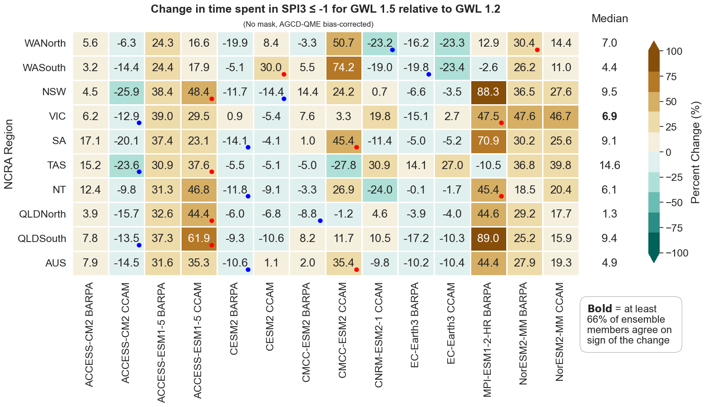
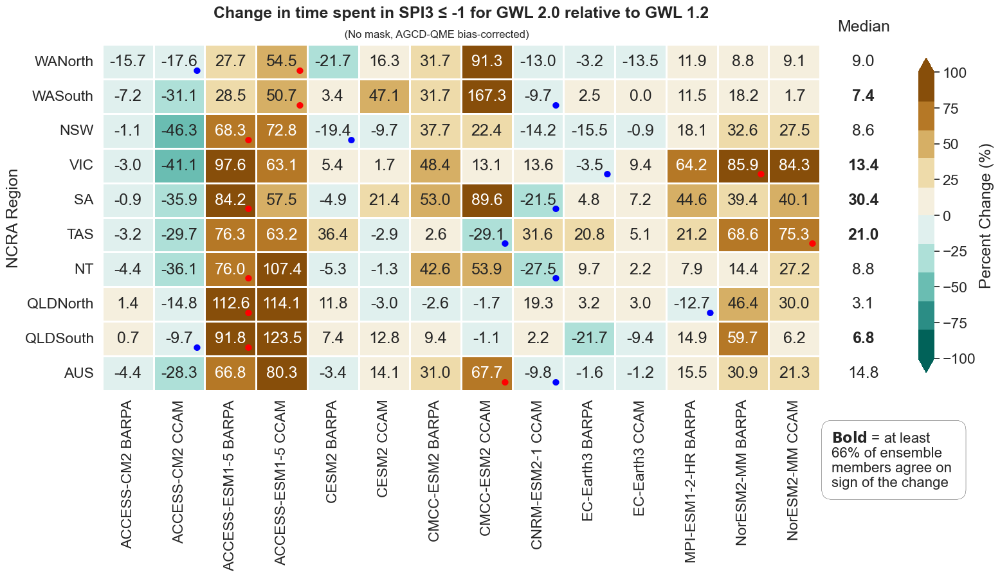

# ACS Hazard Team on Drought and Changes in Aridity

GitHub repository for ACS Drought and Changes in Aridity hazard team to store, track and develop code, key outputs and relevant analysis. 

**Navigation:** [Info about our indices](https://github.com/AusClimateService/hazards-drought/tree/main#information-about-our-indices) | [Product status](https://github.com/AusClimateService/hazards-drought/tree/main#product-status) | [Figures](https://github.com/AusClimateService/hazards-drought/tree/main#figures) | [Analysis for CHO](https://github.com/AusClimateService/hazards-drought/tree/main#analysis-for-climate-hazard-overview) | [FAQs](https://github.com/AusClimateService/hazards-drought/tree/main#faqs) | [Workflow](https://github.com/AusClimateService/hazards-drought/tree/main#workflow) | [References](https://github.com/AusClimateService/hazards-drought/tree/main#references) | [Team contacts](https://github.com/AusClimateService/hazards-drought/tree/main#drought-hazard-team-contacts)  
  Last updated: 22/08/24
   Watermarks removed from change figures + workflow and index information has been edited for clarity.
## Information about our Indices:
### Standardised Precipitation Index (SPI)
The Standardized Precipitation Index (SPI) is a widely used index that measures the amount of precipitation over a specific period relative to the long-term average for that period. It is typically used to identify and quantify the severity of droughts making it a valuable index in water resource management, agriculture, and climate studies for its simplicity and effectiveness in drought monitoring (McKee et al, 1993).
- It standardizes precipitation as a z-score, making it possible to compare different locations and time scales. Positive SPI values indicate wetter-than-average conditions, while negative values indicate drier-than-average conditions.
- E.g. an SPI value of -1 at a given location corresponds to rainfall that is one standard deviation below the long-term average for that location. This value is a common drought threshold signifying moderate drought conditions.
- SPI can be calculated for a range of accumulation periods. We use SPI-3, aggregated over three months.

> #### Our SPI outputs
> -> Proportion of time spent in drought denoted by percent months of SPI3 ≤ -1 for each GWL. 
> -> Percent change in proportion of time spent in drought relative to GWL1.2. For example, if for a location, we had 20% drought in GWL1.2 and 30% in GWL2.0 the _difference_ is 10%. However, the percent change in time spent in drought will be +50% as per (GWL2.0-GWL1.2)/GWL1.2.

### Aridity Index (AI)
The Aridity Index (AI) is a numerical indicator used to quantify the dryness of a region. It is calculated as the ratio of annual precipitation to potential evapotranspiration. Lower values of AI indicate more arid conditions, while higher values suggest more humid conditions. The AI is commonly used in climatology, agriculture, and environmental studies to classify climates, assess water availability, and manage land and water resources (UNEP, 1992).
Aridity categories based on AI values are as follows:
- Hyper-Arid: AI < 0.05
- Arid: 0.05 ≤ AI < 0.2
- Semi-Arid: 0.2 ≤ AI < 0.5
- Dry Sub-Humid: 0.5 ≤ AI < 0.65
- Humid: AI ≥ 0.65

> #### Our AI outputs
> -> AI categories for each GWL. 
> -> Percent change in AI relative to GWL1.2. 
> -> Categorical change in AI relative to GWL1.2. 

### Rainfall percentiles
Rainfall percentiles are statistical measures used to evaluate and interpret precipitation data. They indicate the relative ranking of a given rainfall amount within a historical reference period. 
- We compute the 15th percentile on a three-month rainfall aggregation (smiliar to SPI).
- This represents the threshold value below which 15% of the observed rainfall amounts fall, meaning it is drier than 85% of the reference data (WMO, 2017).
- The 15th percentile threshold can be used to complement our SPI infomation. Our SPI datasets indicates the amount of time spent in drought according to a threshold of SPI -1 which approximates to the 15th percentile threshold. Changes in time spent in drought can be analysed alongside changes to the threshold itself which may change considerably for some regions. 
- This absolute value index (mm) helps to understand how the lower tail of the precipitation distribution may shift.

> #### Our Rainfall percentile outputs
> -> 3-month 15th percentile threshold (mm).
> -> Absolute change in 3-month 15th percentile threshold relative to GWL1.2. 

### Other datasets our team is working on for future deliveries:
- Standardised soil mositure index (SSMI)
- Standardised Precipitation and Evapotranspiration Index (SPEI)
- Standardised runoff index (SRI)
- Evaporative Demand Drought Index (EDDI)
- Evaporative Stress Index (ESI)

## Product Status:
Status of the NCRA deliverables. 

The three dots (in order from first/top/left to last/bottom/right) represent the datasets used to compute indices:
- Dot 1: Pre-processed BARPA/CCAM – downscaled but NOT bias-corrected, 5 km (deliverable for 30 June)
- Dot 2: Bias-corrected BARPA/CCAM – downscaled AND bias-corrected, 5 km (deliverable for 31 July)
- Dot 3: National Hydrological Projections (NHP1.0) based on CMIP5 – bias-corrected, 5km
Where only one dot is in the cell the format type does not apply to the metric, e.g. no time series for rainfall 15th percentile.
 
In terms of the colors:
- :green_circle: The data is available in its final official form
- :yellow_circle: The data creation is currently in progress and available soon
- :red_circle: The data processing has not yet started
- :white_circle: Not intended for delivery/not applicable

| Index/metric | time series (ts) | GWLs ts | GWLs 2D | MME 2D | MME 2D change | Scheduled delivery date | Data location | Last update
|-----         | :-:              |:-:      |:-:      |:-:     |:-:            |------------    |-----             |-----
| SPI3 |:green_circle: :green_circle: :white_circle:|:green_circle: :green_circle: :white_circle:|:green_circle: :green_circle: :white_circle:|:green_circle: :green_circle: :white_circle:|:green_circle: :green_circle: :white_circle:|<ul><li>30 June</li><li>31 July</li><li>N/A</li></ul>|/g/data/ia39/ncra/ drought_aridity/spi/|29/06/24
| Rainfall 15th prctl |:white_circle:|:white_circle:|:green_circle: :green_circle: :white_circle:|:green_circle: :green_circle: :white_circle:|:green_circle: :green_circle: :white_circle:|<ul><li>30 June</li><li>31 July</li><li>N/A</li></ul>|/g/data/ia39/ncra/ drought_aridity/ rainfall_percentiles/|27/06/24
| AI |:white_circle: :white_circle: :green_circle:|:white_circle: :white_circle: :green_circle:|:white_circle: :white_circle: :green_circle:|:white_circle: :white_circle: :green_circle:|:white_circle: :white_circle: :green_circle:|<ul><li>N/A</li><li>N/A</li><li>31 July</li></ul>|/g/data/ia39/ncra/ drought_aridity/ai/|28/06/24

## Figures:
Figures for each 2D metric (SPI <= -1, AI, rainfall percentiles) and GWL as well as for changes relative to GWL 1.2 are located in the index directories (see data location in table above) in the sub directory `/figures/`. We have collated the SPI GWL change figures into an example plot visualised below. This figure depicts the change in 'time spent in drought (SPI <= -1)' for GWL 1.5, 2.0 and 3.0 relative to GWL 1.2 for the 10th, 50th and 90th percentile of the multi-model ensemble:

## Analysis for Climate Hazard Overview:

**Qualitative Analysis:**   
Summary statements from our indices are in : [Drought confidence statements](https://bom365-my.sharepoint.com/:w:/g/personal/david_hoffmann_bom_gov_au/EZFuY9e98C5AgXD-42zgonwBrJq7NoktrsE5bHYmJp5kCQ?e=fzbMML&xsdata=MDV8MDJ8SmVzc2ljYS5CaGFyZHdhakBib20uZ292LmF1fDE2M2Y2N2EwM2ZiMDQxZjk1OGE3MDhkY2MxYzA5ZjE1fGQxYWQ3ZGI1OTdkZDRmMmI4MTZlNTBkNjYzYjdiYjk0fDB8MHw2Mzg1OTgyODE1OTczMTM4Mjd8VW5rbm93bnxUV0ZwYkdac2IzZDhleUpXSWpvaU1DNHdMakF3TURBaUxDSlFJam9pVjJsdU16SWlMQ0pCVGlJNklrMWhhV3dpTENKWFZDSTZNbjA9fDB8fHw%3d&sdata=TkczeWpxdlcrU1RNNDlsRC9zMm9lWTljbnNYRVZ2N0JyYkxhdXZGblM3Yz0%3d)

**Quantitative Analysis:**   
Please note significant caveats apply in averaging 10th, 50th and 90th percentile multi-model ensembles to a spatial region as the representative model for the change is different at each gridcell. Thus we have distilled our quantitative change analysis on a model by model basis for each region, regions where more than 66% of all our ensemble members agree on the sign of the projected change are indicated in bold, meaning a _likely_ change ([IPCC Uncertainty Guidance Note, 2010](https://www.ipcc.ch/site/assets/uploads/2017/08/AR5_Uncertainty_Guidance_Note.pdf)). This analysis could also be useful in devising regional storylines depending on selection of driest/wettest model. For the representative climate future associated with each GCM in the ACS analysis bucket refer to Table 3 from [Grose et al., 2023](https://doi.org/10.1016/j.cliser.2023.100368). 

Heatmaps for other indices can be found in https://github.com/AusClimateService/hazards-drought/tree/main/figures

## FAQs

## Workflow
The following workflow was used to produce the ensemble maps and regional aggregate heatmaps.
#### For absolute values:

#### For changes between GWLs:

## References
* Mckee, T.B., Doesken, N.J., Kleist, J. (1993). The relationship of drought frequency and duration to time scales. In: Proceedings of the 8th Conference on Applied Climatology. American Meteorological Society, Boston, MA, pp. 179–183.
* United Nations Environment Programme (UNEP) (1992). World Atlas of Desertification. Edward Arnold. https://wedocs.unep.org/20.500.11822/42137
* WMO. (2017). WMO Guidelines on the Calculation of Climate Normals. WMO-No. 1203, 1203, 29. https://library.wmo.int/doc_num.php?explnum_id=4166

## Drought hazard team contacts
- [ ] David Hoffmann (BOM, lead)
- [ ] Tess Parker (CSIRO, alternate lead)
- [ ] Jessica Bhardwaj (BOM, contributor)
